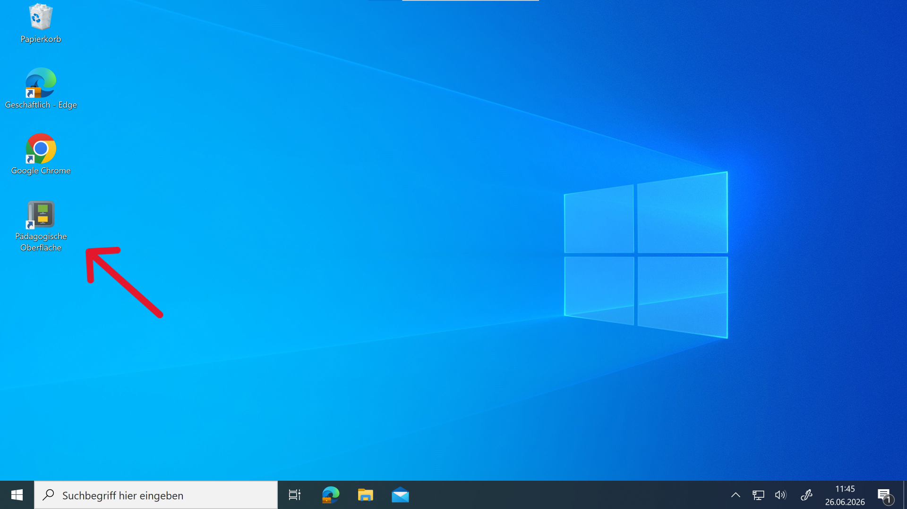
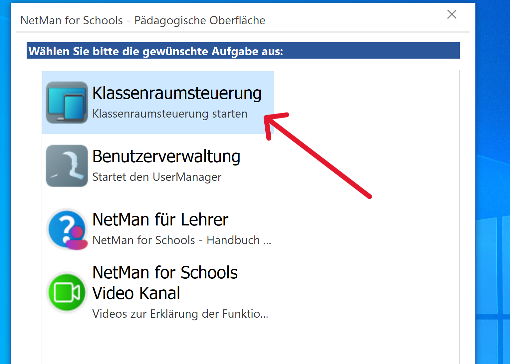
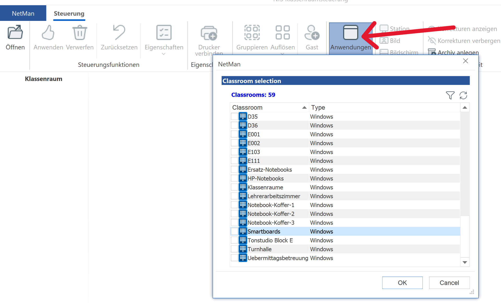
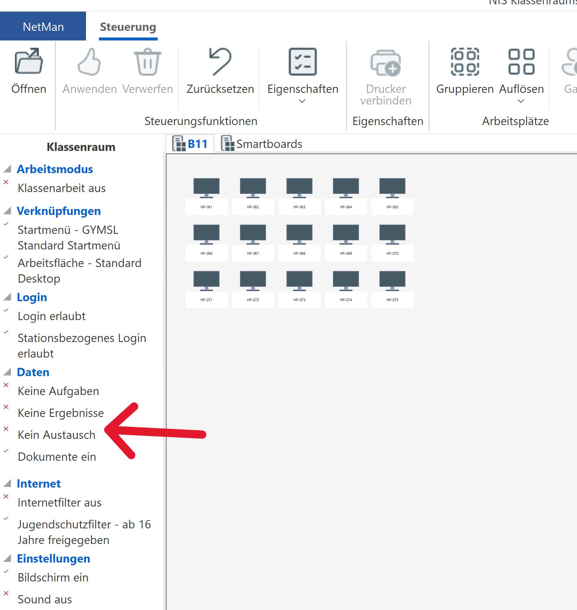
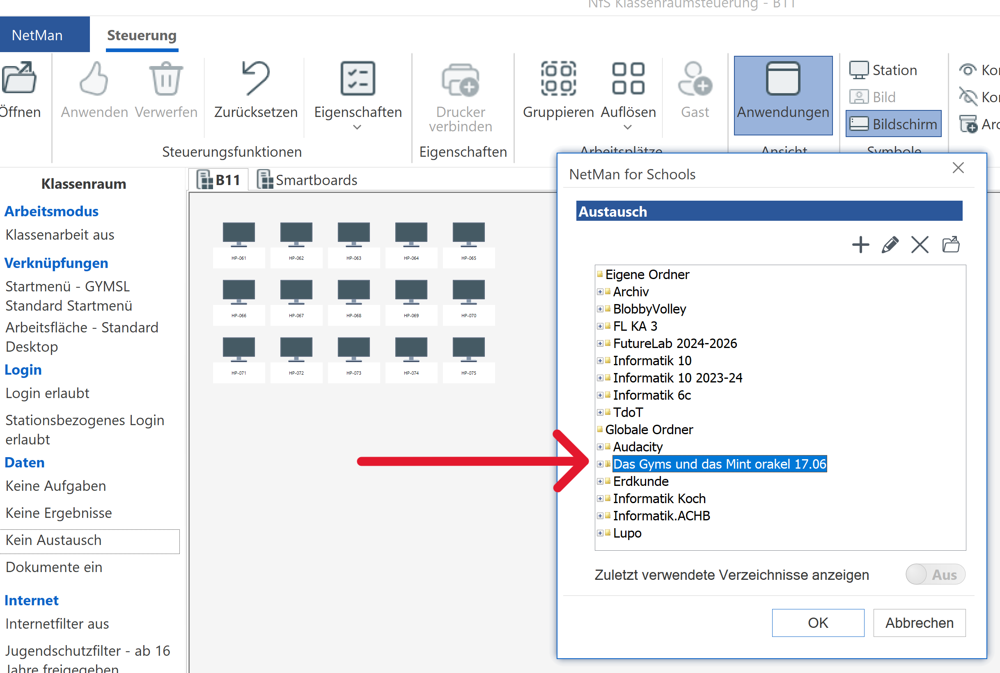
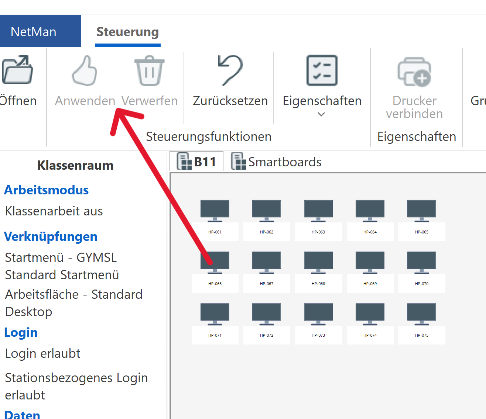

# __Nutzung im Unterricht__

## __Installation und Starten des Spiels__

1. __Auf einem Schulrechner einloggen.__
    - Entweder ein Schülerlaptop oder das Smartboard.

2. __Auf dem Desktop die "Klassenraumsteuerung" starten.__
    
    
3. __Den passenden Raum öffnen. ("Öffnen")__
     

4. __Links in der Leiste "Autausch" auswählen, dann "Ändern".__
    

5. __In der sich öffnenden Liste "Globale Austauschordner-> Das Gyms und das Mint orakel 17.06" wählen__
    

6.  __"Ok" klicken.__

7. __Oben in der Icons-Leiste auf "Anwenden" gehen (Daumen hoch Symbol)__
    

Nach dem die Änderungen angewendet wurden, sollte die Spiel-Datei für die Schüler unter dem Austausch Ordner verfügbar sein. 

## __Wie können die Schüler das Spiel starten?__
Am Besten schickt man der Klasse während der Unterrichtsstunde eine E-Mail mit folgendem Link.   
[Anleitung für Schüler](https://nood3ls.github.io/dragonsoft-guide/).   
Das ist der Leitfaden für die Schüler, in dem erklärt wird wie das Spiel gestartet wird.

## __Grundlegene Steuerung und Karte__
Der Spielcharakter lässt sich mit den Tasten **W**, **A**, **S**, **D** steuern.
Neue Räume können erkundet werden, indem man mit dem Spielcharakter auf die Türen zuläuft. 

## __Wie können Sie das Spiel konkret in Ihren Unterricht integrieren?__

*	**Differenzierungsphasen**: Setzen Sie das Spiel in Übungs- und Freiarbeitsphasen ein. Während Sie sich um einzelne Schüler kümmern, können andere ihre fachspezifischen Fragen im Chat an das „MINT-Orakel“ richten und erhalten sofortiges Feedback.
*	**Hausaufgaben- oder Prüfungsvorbereitung**: Lassen Sie Schüler gezielt den virtuellen Fachlehrer aufsuchen, um Themen der letzten Stunden zu wiederholen (z. B. Grammatik-Regeln erklären lassen oder Formeln in Physik hinterfragen).
*	**Interdisziplinäres Lernen**: Schüler können zwischen den Räumen wechseln und fachübergreifende Konzepte erfragen.

## __Sicherheit und Transparenz__
Damit Sie als Lehrkraft den Überblick über die Fragen behalten, gibt es eine Extraseite, auf der Sie die wichtigsten Informationen einsehen können.
Die Fragen werden mit Zeitstempel, Lehrkraft, Frage und Antwort gespeichert.

### Hinweis 
Sagen Sie Ihren Schülern ausdrücklich, dass die Fragen und Antworten gespeichert werden.